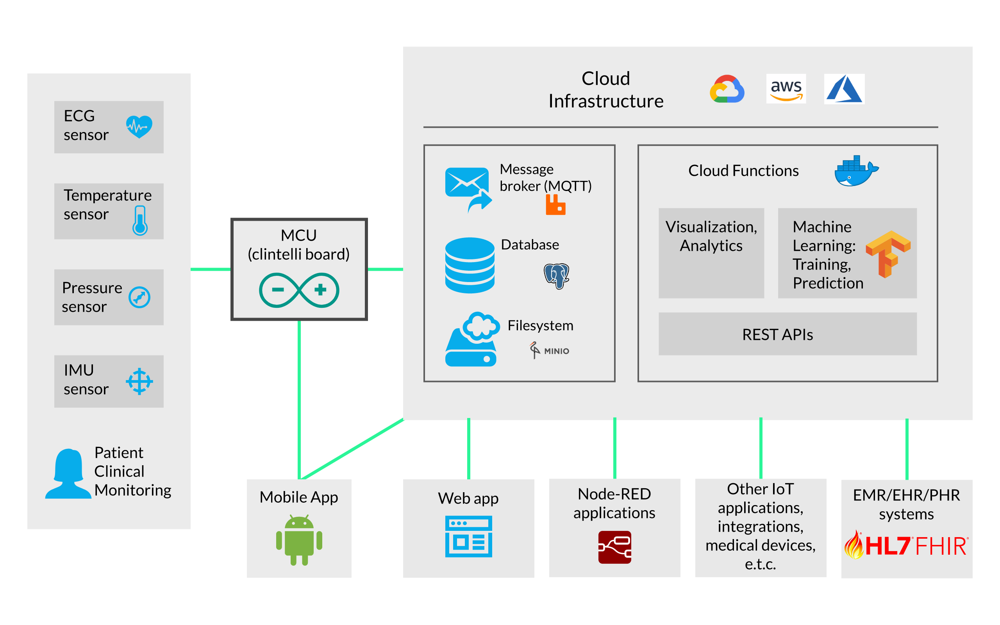

# Clintelli Platform Architecture

## Platform architecture

## Project file structure

- **arduino**: All source code to be compiled and uploaded to an Arduino board
- **cad**: CAD files, Electronics Schematics, PCB layouts, BOMs etc.
- **docker**: Dockerfile and docker-compose configuration file for easily setting up a
    RabbitMQ MQTT server
- **docs**: Clintelli platform documentation
- **sub**: Code for subscribers