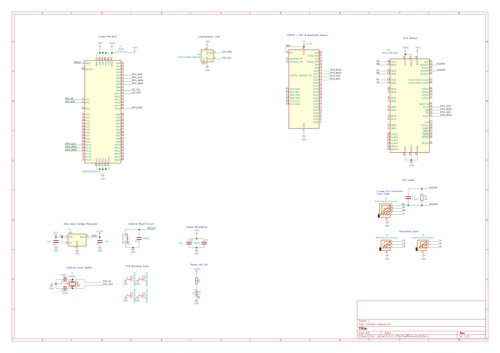

# Custom hardware

In order to transform the clintelli IoT wearable prototype into a production ready product, we
decided to design our own customized, open-source, arduino-based microcontroller board, 
the **Clintelli board**.

## Overview

## Components

- Cortex M4 (STM32F302)
- ESP32 (ESP-32-WROOM-32)
- ECG Module (ADS1298)
- Cryptographic chip (ATECC608A)

## ECG Module - MCU SPI

| SPI | ECG GPIO | Cortex M4 Pins | Connection name |
| --- | ---------- | -------------- | --------------- |
| MOSI | 34 | 23 | SPI1_MOSI |
| MISO | 43 | 22 | SPI1_MISO |
| SCK | 40 | 21 | SPI1_SCK |
| SS | 39 | 20 | SPI1_NSS |

## ESP32 Module - MCU SPI

| SPI | ESP32 GPIO | Cortex M4 Pins | Connection name |
| --- | ---------- | -------------- | --------------- |
| MOSI | 13 | 53 | SPI3_MOSI |
| MISO | 12 | 52 | SPI3_MISO |
| SCK | 14 | 51 | SPI3_SCK |
| SS | 15 | 50 | SPI3_NSS |